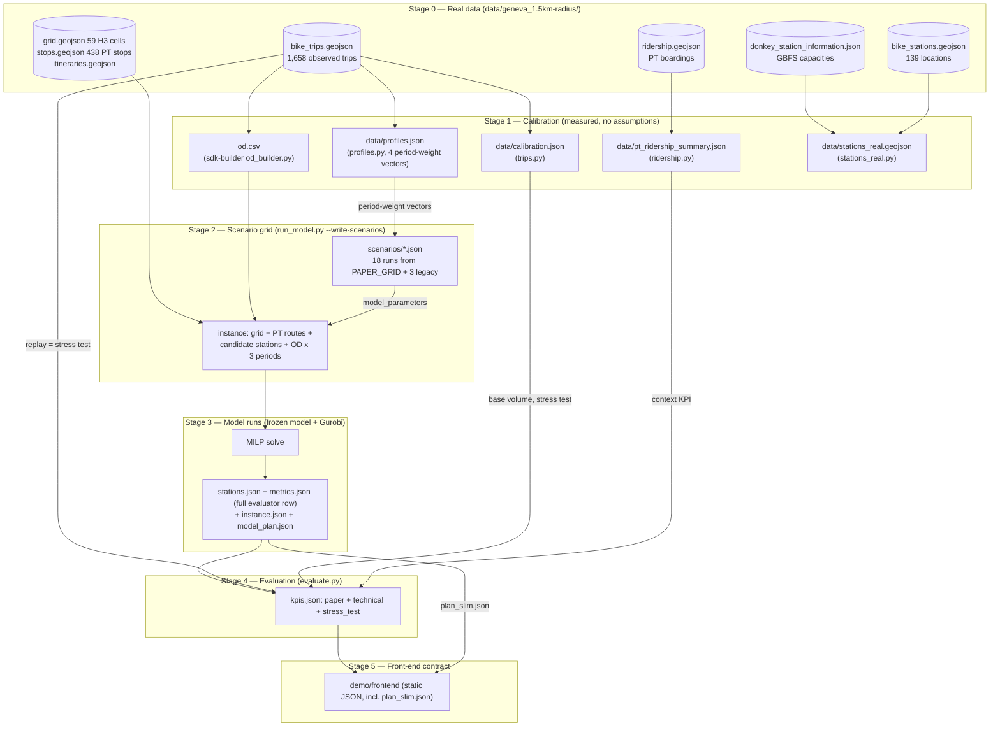

# The decision experience

This folder is the design and the engine of the public-facing demonstration: *you are the
city — pick a plan, see what the paper's own model decided, compare it against the paper's
sensitivity analysis*. It lives on the demonstration side of the repository (`demo/`), beside
the front-end that renders what it produces; the optimisation model in
`network-design-bss/src/` is never modified.

Demo v3 (2026-09-15) realigns the demonstration with the submitted paper *Network Design of
Bike Sharing Systems with Public Transport Integration* (Wu, Sharif Azadeh, Brotcorne): the
paper never simulates individual trips, so neither does the demonstration's primary evaluation
any more. Every headline number is read from **the model's own solved plan**, on the paper's
potential-demand day (1,453 trips, 703 OD pairs, 100 candidate stations, T = 3 periods) — not
from a re-simulation. A separate, clearly labelled **stress test** replays the trips Geneva
actually recorded, as a demo-side robustness check.

The four questions the demonstration is built around, restated from the paper's own sensitivity
analysis:

1. How much should the city invest — and where does the next euro stop paying off?
2. When does bike sharing start feeding the trams and buses, instead of replacing short rides?
3. Should money go into trucks that move bikes around, or into more docks and stations?
4. Does the rhythm of the day — commuters on Monday, leisure on Sunday — change where the
   stations should go?

## Layout

| Path | Role |
| --- | --- |
| `data/geneva_1.5km-radius/` | The layer's own data: the model's input sample plus the **real observed layers** — GBFS stations & capacities, PT ridership, the trip records (used by the stress test and the front end's day view). The layer reads only from here, never from the frozen model. |
| `scenarios/` | The paper's 18-run sensitivity grid, generated from `run_model.PAPER_GRID`, plus three legacy scenarios kept until the grid is run. See [`scenarios/README.md`](scenarios/README.md). |
| `trips.py` | The canonical table of observed trips (local time, coordinates) and the **measured** daily volumes. Writes `data/calibration.json`. Feeds the stress test. |
| `profiles.py` | Derives Monday/Sunday hourly demand profiles and the four period-weight vectors (bimodal, uniform, unimodal-sharp, the observed Geneva weekday) from the observed trips. Writes `data/profiles.json`. |
| `ridership.py` | Real PT boardings per stop/day/hour: validates the bike profiles' timezone, feeds a context KPI, exports `data/pt_ridership_summary.json` for the front-end. |
| `stations_real.py` | Today's real network: locations joined with real GBFS capacities (`data/stations_real.geojson`). Visualization only — no bike-stock data exists to simulate it. |
| `run_model.py` | Runs a scenario against the frozen model and writes its full design, including the model's **full** evaluator row. `PAPER_GRID` is the single definition of the 18 scenarios; `write_scenarios()` turns it into `scenarios/<id>.json`. Replaces the edit-and-revert procedure: it swaps `generate_h3_instances()` in `sys.modules` for one run, so the model source is never touched. |
| `simulate.py` | Replays one day against any station design — now only the **stress test** (`--mode replay`, the observed trips). The `sample`/`instance` modes are **DEPRECATED**. See `METHODS.md` §3. |
| `evaluate.py` | Turns a solved scenario into `kpis.json`: `paper` (the paper's own metrics), `technical` (the full evaluator row + solver stats), `stress_test` (the replay). Builds the cross-scenario comparison table. |
| `pipeline/` | Shared logic used by more than one module: `timeutil.py` (the single UTC→Europe/Zurich conversion and day-type mapping), `geometry.py` (the single haversine), `config.py` (`load_kpi_config`: reads `kpi_config.json`, fills unit costs from the frozen model's `util/cost.py` at runtime), `model_plan.py` (builds `instance.json` / `model_plan.json` / `bike_arcs.json` from a live solved model — what `run_model.py` writes and `evaluate.py`'s `paper` block reads). `instance.py` is **DEPRECATED** (readers for the deprecated simulation modes). |
| `baseline.py` | **DEPRECATED** (demo v3): the naive "human" design at a given budget. Superseded by the budget ladder itself — every point on it is an optimised design, so the contrast is between budgets, not between a human and the optimiser. |
| `tests/` | Unit and golden tests (unittest-style, pytest-compatible): `test_golden_pipeline.py` pins calibration, the replay stress test, `evaluate_scenario`'s `kpis.json` and the whole scenario grid against the committed artefacts (deprecated-mode pins kept but skipped); `test_src_parity.py` pins the constants shared with the frozen model; `test_timeutil.py`, `test_geometry.py`. Run with `python3 -m unittest discover -s demo/experiments/tests -t .` or `python3 -m pytest demo/experiments/tests`. |
| `kpi_config.json` | The behavioural parameters the stress test still uses (walk catchment, retries, detour factor, ride speed, truck capacity), plus the unit costs read live from the frozen model's `util/cost.py`. The mode-substitution, emission-factor, equivalence, fare/maintenance/amortisation and growth-scenario blocks are **DEPRECATED**, marked `"_deprecated": true`. |
| `METHODS.md` | The scientific reference: data sources, algorithms, assumption register, limitations. |
| `SPEC.md` | History: how the demo layer's numbers were originally derived (pre-v3); superseded by this README and `METHODS.md` for current method. |
| `results/<scenario>/` | Per scenario: `stations.json` (design) + `metrics.json` (the model's **full** evaluator row) + `instance.json` (the instance solved, slimmed) + `model_plan.json` (the solved per-period decision) + `kpis.json` (`paper` / `technical` / `stress_test`), plus optionally `sim_monday.json` / `sim_sunday.json` (the stress test). `results/shared/bike_arcs.json` holds the model's OSM-routed arc distances, common to the whole grid (identical candidate geography). This is the data contract the front-end reads. |

## The pipeline, end to end

Everything the demo shows is produced by one pipeline in six stages. Each stage reads
only files, writes only files, and records its provenance — so any number on screen can
be traced back to an observation, a solved model decision, or a stated assumption (the
register lives in [`METHODS.md`](METHODS.md)).



### Stage 0 — Real data

All inputs live in `data/geneva_1.5km-radius/`, the layer's own copy — the frozen model
tree is never read or written by this layer.

| File | Content | Nature |
| --- | --- | --- |
| `bike_trips.geojson` | 1,658 shared-bike trips (2024-06-06 → 2024-12-04): start/end coordinates, naive UTC timestamps, distance | **Observed** (operator) |
| `ridership.geojson` | PT boardings/alightings at 156 stops, per day-of-week × hour, summed over one year | **Observed** (PT operator) |
| `bike_stations.geojson` | 139 bike-share station locations | **Observed** (operator) |
| `donkey_station_information.json` | GBFS feed: 623 stations with real capacities | **Observed** (provider API) |
| `grid.geojson`, `stops.geojson`, `itineraries.geojson` | 59 H3 zones, 438 PT stops, PT lines | Model input sample |
| `od.csv` | Cell-to-cell flow table | **Derived** from the trips (Stage 1) |

### Stage 1 — Calibration: what is measured, and how

Four modules turn the raw observations into the measured quantities the rest of the pipeline
uses. Nothing in this stage is assumed except the UTC reading of the trip timestamps
(cross-validated against PT peaks; see `METHODS.md` §2).

**Timezone normalisation** (`trips.py`, `profiles.py`). Naive `trip_started_at_utc`
timestamps are read as UTC and converted to Europe/Zurich. Every derived time quantity
(hour, day type) is local.

**OD table** (`network-design-bss/sdk-builder/sum_network_design_bss/od_builder.py` →
`od.csv`). Each trip's endpoints are assigned to grid cells by point-in-polygon test
against `grid.geojson` (never by recomputing an H3 index — the sample's cell ids come
from a producer with transposed lat/lon). Intra-cell trips are dropped. The flow is a
plain count over the whole observation window:

$$\mathrm{flow}(o,d) = \left|\{\, \text{trips with origin cell } o \text{ and destination cell } d,\ o \neq d \,\}\right|$$

**Daily volumes** (`trips.py` → `data/calibration.json`). For each day type
$d \in \{\text{weekday}, \text{saturday}, \text{sunday}\}$:

$$\text{trips\_per\_day}(d) = \frac{\text{n trips of type } d}{\text{n distinct calendar days of type } d \text{ observed}}$$

giving 11.51 (112 weekdays) / 9.48 (21 Saturdays) / 9.44 (18 Sundays), plus the median
and mean trip distance. These are the **stress test's** base volumes; the observed
day itself, replayed, is the only demand this pipeline still simulates.

**Demand profiles** (`profiles.py` → `data/profiles.json`). With $n_h$ the trip count at
local hour $h$ for a day type:

$$\text{hourly\_share}(h) = \frac{n_h}{\sum_{h'=0}^{23} n_{h'}}, \qquad
\text{period\_weight}(p) = \frac{\sum_{h \in [lo_p, hi_p)} n_h}{\sum_{p'} \sum_{h \in [lo_{p'}, hi_{p'})} n_h}$$

over the model's three periods $[6,10) / [10,16) / [16,22)$ local — weekday
$(0.169, 0.343, 0.488)$, Sunday $(0.022, 0.346, 0.632)$. The 24-hour vector feeds the
stress test's hourly detail; the weekday 3-period vector is the `geneva_weekday`
temporal profile, one of the four the scenario grid's `rhythm` family compares (the
other three — bimodal 0.40/0.20/0.40, uniform ⅓ each, unimodal-sharp 0.60/0.20/0.20 —
are the paper's own values, defined as constants in `run_model.py`, not measured).

**PT context** (`ridership.py` → `data/pt_ridership_summary.json`). Daily boardings per
day of week = yearly sum / 52 (holidays uncorrected). Its peak hours (16–18h local)
coinciding with the converted bike peaks is the timezone cross-check.

**Today's network** (`stations_real.py` → `data/stations_real.geojson`). The 139 local
stations joined to GBFS capacities by French name, falling back to nearest coordinate
within 50 m: 128/139 matched. Visualization only — no bike-stock data exists to simulate
it.

### Stage 2 — The scenario grid, and building the optimisation instance

A scenario (`scenarios/<id>.json`, `"schema": "scenario-v3"`) is one `model_parameters` block:
`total_budget`, `op_budget_ratio`, `demand_periods` (3), `period_weights`, `split_method`
(multinomial), `seed`, `epsilon`, `solve_mode` — plus the front-end copy and provenance fields
described in [`scenarios/README.md`](scenarios/README.md). The 18 scenarios of the paper's
sensitivity grid are **generated, not hand-written**: `run_model.PAPER_GRID` is the single
definition (budget, operational-ratio, epsilon and temporal-profile axes around the paper's
Table D.8 baseline — 80,000 €, ratio 0.05, ε = 0.04, bimodal profile 0.40/0.20/0.40), and
`write_scenarios()` turns it into the JSON files:

```bash
python -m demo.experiments.run_model --write-scenarios               # the whole grid
python -m demo.experiments.run_model --write-scenarios budget_020k   # only the ids given
```

`run_model.py` then injects the chosen scenario into the frozen model by replacing
`generate_h3_instances()` in `sys.modules` for one run — the source on disk is untouched (see
[`scenarios/README.md`](scenarios/README.md)).

The frozen `InstanceGenerator.build_realistic_scenario()` assembles the instance:

1. **Zones** — the 59 H3 cells of `grid.geojson`.
2. **PT network** — routes and stops from the sample (stops double as candidate
   transfer stations).
3. **Candidate stations** — generated bike-station candidates plus PT transfer stops,
   filtered to points inside the grid polygon, then merged when closer than 100 m.
4. **Demand** — `od.csv` flows, scaled by `demand_scale` (1.0 here), then split into the
   3 periods: each OD flow $F$ is treated as $F$ independent travellers choosing a
   period, $\text{alloc} \sim \mathrm{Multinomial}(F, w)$ with $w$ the scenario's
   `period_weights` and a fixed seed, so $\sum_t \mathrm{flow}_t = F$ exactly and runs
   are reproducible.
5. **Paths** — shortest-path enumeration produces, per OD pair, ranked candidate paths
   of two categories: `bike_only` and `bike_pt` (bike + public transport). This is the
   expensive stage (~50 min cold) and is cached under keys that carry **no scenario
   parameter**, so running the grid back to back pays it once.

The resulting MILP has 53,558 variables / 36,535 constraints for this instance.

### Stage 3 — The optimisation model, and what a run writes

Decision variables (per candidate station $i$, period $t$, OD pair $k$, path $r$):

| Variable | Meaning |
| --- | --- |
| $y_i \in \{0,1\}$ | build station $i$ |
| $w_i$ | capacity of station $i$ (docks) |
| $v_{i,0}$ | bikes stocked at $i$ at the start of the day |
| $x^{b}_{k,t,r}, x^{pt}_{k,t,r}$ | demand of OD $k$ in period $t$ assigned to bike-only / bike+PT path $r$ |
| $n_{i,j,t}$ | rebalancing truck dispatches on arc $(i,j)$ in period $t$ |

**Objective** (single-stage weighted form, `solve_mode="integrated"`,
`model/objective.py::set_weighted_multi_objective`): maximise served bike-related flow,
discounted by a ranking penalty that discourages longer (lower-ranked) paths, minus an
$\varepsilon$-weighted rebalancing cost:

$$\max\; \sum_{k,t,r} \bigl(1 - \lambda\, \pi_{k,r}\bigr)\,\bigl(x^{b}_{k,t,r} + x^{pt}_{k,t,r}\bigr) \;-\; \varepsilon \sum_{(i,j),t} n_{i,j,t}\,\bigl(c_{\text{fix}} + c_{\text{reb}}\, d_{ij}\bigr)$$

with $\pi_{k,r}$ the path's rank-based inferiority, $\lambda$ the penalty coefficient,
$\varepsilon$ the scenario's `epsilon` (0.04 at the baseline; 0, 0.01, 0.08, 0.12 across the
`epsilon` family), $c_{\text{fix}} = 40$ € per dispatch, $c_{\text{reb}} = 20$ €/bike-km,
$d_{ij}$ the arc distance.

**Budget constraints** (`model/constraints.py`, unit costs from `src/util/cost.py`):

$$\underbrace{\sum_i c_s\, y_i}_{\text{stations, } c_s = 100€} + \underbrace{\sum_i c_p\, w_i}_{\text{docks, } c_p = 20€} + \underbrace{\sum_i c_u\, v_{i,0}}_{\text{bikes, } c_u = 60€} \;\le\; Q, \qquad \sum_{(i,j),t} n_{i,j,t}\,\bigl(c_{\text{fix}} + c_{\text{reb}}\, d_{ij}\bigr) \;\le\; Q_r$$

where the frozen model sets $Q = \text{total\_budget}$ and
$Q_r = \text{op\_budget\_ratio} \times \text{total\_budget}$ (`model/parameters.py`).
`run_model.py` records both envelopes directly: `capex_budget_eur` equals the
*full* `total_budget` (matching $Q$, the capital constraint) and
`operational_budget_eur` equals $Q_r$ (the additional operational envelope).
Until 2026-09-09, `capex_budget_eur` was computed as
$\text{total\_budget} \times (1 - \text{op\_budget\_ratio})$, understating the
capital envelope the solver actually uses; fixed in `run_model.py` and the
committed `stations.json` files.

Further constraints link flow to built stations (a path can carry flow only if its
bike arcs' stations are built), bound capacity
($\text{MIN\_CAPACITY} \cdot y_i \le w_i \le q_{ub}\, y_i$), conserve per-period bike
stocks, and tie rebalanced volume to truck capacity
($r_{i,j,t} \le 10\, n_{i,j,t}$).

**What a run writes.** `run_model.py` writes four files per scenario into
`results/<scenario_id>/`, each carrying a full provenance block (`run`: parameters, Gurobi
status, MIP gap, variable and constraint counts, wall clock, and the
`src_commit`/`repo_commit` that produced the result) so a design is auditable without
re-running:

- **`stations.json`** — the design: one entry per built station
  (`station` id, `type`, `lon`, `lat`, `capacity` $= w_i$, `initial_bikes` $= v_{i,0}$).
- **`metrics.json`** — the model's **full evaluator row**: every field of
  `NetworkDesignRun.experiment_row` (`ExperimentRow`, JSON-sanitised), not only the 15
  `HEADLINE_METRICS` — instance/model size, solver statistics, served flow and coverage,
  travel time, station layout, capacity/utilisation by type, rebalancing (the table in
  `METHODS.md` §5 lists every field and where it is discussed in the paper).
- **`instance.json`** — the instance the model actually solved, slimmed (no polygons,
  no PT routes): the 56 buildable H3 cells, the 100 candidate stations, and the
  1,453-trip demand by origin/destination/period.
- **`model_plan.json`** — the solver's full decision, one level below `metrics.json`'s
  summary: per-candidate built/capacity/inventory by period, rebalancing moves and
  truck dispatches per period, and per-OD path assignments (which stations each path
  uses, and its `bike_only` / `bike_pt` category). This is what `evaluate.py`'s `paper`
  block reads.
- **`results/shared/bike_arcs.json`** — the model's OSM-routed ride distance/time
  between candidate stations (`NetworkBuilder.shortest_path_km_min`); one file, since
  the candidate geography is identical across the whole grid.

`pipeline/model_plan.py` builds the last three (`instance.json`, `model_plan.json`,
`bike_arcs.json`); `run_model.py` only calls it and writes what it returns.

### Stage 4 — Evaluation

`evaluate.py` writes `kpis.json` (`"schema": "kpis-v3"`) per scenario, from `model_plan.json` +
`metrics.json` (+ `sim_monday.json` / `sim_sunday.json` when present). Three blocks; no
coefficient from `kpi_config.json` reaches `paper` or `technical`:

**`paper`** — the paper's own metrics, read off the solved plan and the evaluator row:

$$\text{served\_ratio} = \frac{\text{served\_total}}{\text{demand\_total}}, \qquad
\text{pt\_assisted\_share} = \frac{\text{flow\_bike\_pt}}{\text{flow\_bike\_only} + \text{flow\_bike\_pt}}$$

$$\text{avg\_time\_gain\_min} = \text{average\_time\_gain}, \qquad
\text{time\_saving\_ratio} = \frac{\text{avg\_time\_gain\_min}}{\text{avg\_time\_gain\_min} + \text{avg\_travel\_time\_min}}$$

$$\text{investment\_per\_served\_trip\_eur} = \frac{\text{total\_budget}}{\text{served\_total}}$$

plus per-period demand / served / bike-only / bike-PT arrays (from `model_plan.assignments` and
`demand`), the layout built (stations, regular vs transfer, docks, bikes), rebalancing
(dispatches, bikes rebalanced, `dispatch_cost_eur` — the same cost term as the objective's
rebalancing penalty above), covered OD ratio, and compactness (`nearest_neighbor_m`,
`mean_pairwise_m` — the evaluator's own metres; `null` for a legacy `metrics.json` that
predates the full evaluator row).

**`technical`** — the frozen evaluator's full `ExperimentRow`, written as-is (no
recomputation, per the reuse rule in `AGENTS.md`), plus the solver statistics the row does not
carry (`n_variables`, `n_constraints`, `gurobi_status`, `mip_gap`, `wall_clock_s`, `ran_at`).
Shown under the front end's advanced toggle.

**`stress_test`** — the observed-trip replay (`simulate.py --mode replay`, `METHODS.md` §3):
`monday`/`sunday` demand, served, served ratio, unserved by cause, peak empty/full stations, and
the replay's own `method` block. Explicitly labelled a demo-side robustness check on Geneva's
recorded trips (~125× smaller than the planning day), not part of the paper's own evaluation.

> **Deprecated formulas (kept in `kpi_config.json`, no longer computed).** Earlier versions of
> this evaluation also produced service / mobility / environment / economics KPIs — net CO₂
> avoided (translated into car-days and trees-per-year), operating result, cost per served trip,
> fare revenue — from invented mode-substitution shares, lifecycle emission factors, and a
> fare/maintenance/amortisation model, all at the *observed*-trip scale (~125× below the
> planning day). None of this is in the paper; it is superseded by the `paper` block above and
> reachable only through the deprecated `evaluate.evaluate_day_legacy`. The coefficients remain
> in `kpi_config.json`, marked `"_deprecated": true`, until the paper-grid runs are validated.

### Stage 5 — Front-end contract

Everything the front end needs is a static JSON contract under `results/<id>/`: `stations.json`
(the design to draw on the map), `kpis.json` (the scorecard), `model_plan.json` (per-period
inventories — `prepare-data.mjs` derives the slimmed `plan_slim.json` the map actually ships, so
the ~1 MB solved plan is never sent to the client). `metrics.json` and the stress-test
`sim_<day>.json` files are optional: their absence only hides the advanced-view rows and the
stress-test panel that need them. So the front end stays a purely static page fed by files this
layer produces offline, and adding a results folder plus a scenario JSON adds a scenario with no
code change ([`demo/frontend/README.md`](../frontend/README.md)).

## The four questions and the scenario grid

All 18 runs share the paper's potential-demand day (1,453 trips, 703 OD pairs, 100 candidate
stations), T = 3, and the Table D.8 baseline (80,000 €, operational ratio 0.05, ε = 0.04,
bimodal profile 0.40/0.20/0.40) unless the row's own axis is what varies — so every difference
in outcome is attributable to that one change. One family per question:

| family | axis | question | members | paper |
| --- | --- | --- | --- | --- |
| `budget` | `total_budget` | Q1, Q2 | 20k\* · 40k\* · 60k · **80k = baseline** · 100k · 120k | Table 2 budgets {60, 80, 100, 120 k}; Fig. 9, 12a, 14 |
| `ops_ratio` | `op_budget_ratio` | Q3 | 0 % · 2.5 % · **5 % = baseline** · 7.5 % · 10 % · 12.5 % | Table 2; Fig. 7–8 |
| `epsilon` | `epsilon` | Q3 | 0 · 0.01 · **0.04 = baseline** · 0.08 · 0.12 | Table 3 aggregates over {0, 0.01, 0.04, 0.08, 0.12}; Fig. 6–8 |
| `rhythm` | `temporal_profile` | Q4 | **bimodal = baseline** · uniform · unimodal-sharp · the observed Geneva weekday | Table 2 profiles; Fig. 12 |

\* below the paper's own Table 2 range, added to locate the budget threshold where the network
switches from a bike-only to a PT-connected regime (Fig. 14). The baseline scenario belongs to
every family at once, at its own axis value.

Cards on step 3 of the web demo: `budget_060k` Essential, `budget_080k` Reference (the paper's
baseline), `budget_120k` Ambitious. Full field reference and how to add a run:
[`scenarios/README.md`](scenarios/README.md).

Legacy `S1_essential` / `S2_balanced` / `S3_ambitious` (20k / 80k / 140k €, observed Geneva
weekday weights, operational ratio 2.5 % / 2.5 % / 5 % — not the paper's bimodal baseline) are
the three scenarios the demo shipped with before this realignment; real Gurobi solves from
2026-09-10, kept flagged `"legacy": true` until the paper grid is run and replaces them.

## Deprecated, kept until the paper-grid runs are validated

Marked (module docstring + `DeprecationWarning`), no longer called by the live pipeline, tests
skipped rather than deleted (full list and reasons: `AGENTS.md`, `tests/README.md`):

- `simulate.py`'s `sample` and `instance` modes (and the CLI's `--mode sample|instance`) —
  superseded by reading `model_plan.json` directly, rather than re-simulating it.
- `baseline.py` — superseded by the budget ladder itself.
- `pipeline/instance.py` — readers for the deprecated simulation modes.
- `evaluate.evaluate_day_legacy` (formerly `evaluate_day`) — the simulator-based service /
  mobility / environment / economics KPI families.
- `kpi_config.json`'s `mode_substitution`, `unserved_fallback`, `emission_factors_g_per_pkm`,
  `equivalences`, `demand.growth_scenarios`, and `costs.amortization_years` /
  `maintenance_eur_per_bike_per_day` / `fare_eur_per_trip`.
- Already deleted, not just deprecated: every `sim_monday_x25.json`, `sim_instance.json`, and
  `results/baseline_20k/`.

## End-to-end commands

```bash
python3 -m demo.experiments.trips          # measure volumes  -> data/calibration.json
python3 -m demo.experiments.profiles       # hourly profiles + period-weight vectors -> data/profiles.json
python3 -m demo.experiments.ridership      # PT context + timezone check -> data/pt_ridership_summary.json
python3 -m demo.experiments.stations_real  # today's network  -> data/stations_real.geojson

python3 -m demo.experiments.run_model --write-scenarios          # generate scenarios/*.json from PAPER_GRID
python3 -m demo.experiments.run_model budget_080k                # one model run (Gurobi licence required)

python3 -m demo.experiments.simulate --stations demo/experiments/results/budget_080k/stations.json --day monday   # optional: the replay stress test
python3 -m demo.experiments.evaluate demo/experiments/results/budget_060k demo/experiments/results/budget_080k demo/experiments/results/budget_120k --compare

python3 -m unittest discover -s demo/experiments/tests -t . -v   # or: python3 -m pytest demo/experiments/tests
```

Calibration, scenario generation, the stress test and evaluation run on the standard library
alone; only `run_model` needs the full environment and a Gurobi licence larger than the
size-limited one bundled with `gurobipy` (the instance is ~53k variables / ~36.5k constraints).
**Nobody but the user runs the experiments**: the supported way to run the 18-scenario grid is
[`notebooks/demo_scenarios.ipynb`](../../notebooks/demo_scenarios.ipynb), one scenario at a
time.

## Known gaps

Open upstream questions that affect how a few of the numbers above should be read (the model is
frozen, so these are reported, not fixed, here — full list in `AGENTS.md`'s "Known upstream
issues"): whether `od.csv` flow is one day's demand or a horizon total; `compute_distance`
passing `(lon, lat)` to a haversine expecting `(lat, lon)`; OD rows whose cell is unbuildable not
being filtered out (~60 trips that can never be served); `covered_od_ratio` counting OD *pairs*
with any positive assignment, not flow volume.

New in v3: **`dispatch_cost` is computed twice** for the same rebalancing decisions — once
inside the frozen evaluator's `experiment_row` (`technical.dispatch_cost`, written into
`metrics.json`) and again by `pipeline/model_plan.py` (`paper.dispatch_cost_eur`, from the same
`r`/`n` moves and the model's own unit costs, §Stage 3). The two should agree exactly; confirming
that on the paper-grid runs is one of the checks before calling this realignment done.

- Today's real network (`data/stations_real.geojson`) is visualization-only: no source for
  per-station bike stocks exists. GBFS `station_status` history (manual weekly sampling) would
  make it simulatable and provide observed morning stocks.
- Saturday is measured (`calibration.json` carries its volume) but has no `temporal_profile` /
  `rhythm`-family entry yet.
- The UTC reading of trip timestamps is cross-validated against PT ridership peaks but still
  awaits confirmation by the data producer.
