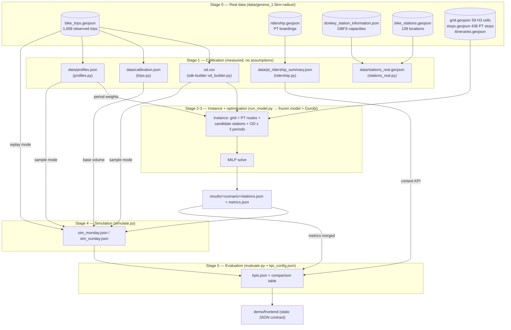

# The decision experience

This folder is the design and the engine of the public-facing demonstration: *you are the
city — choose a strategy, watch a day unfold, see the impacts*. It lives on the
demonstration side of the repository (`demo/`), beside the front-end that renders what it
produces; the optimisation model in `network-design-bss/src/` is never modified.

The pedagogical arc it supports:

1. **The problem.** 59 zones, 438 PT stops, observed bike trips. Where do you put
   stations, how big, with how many bikes — on a budget?
2. **The human attempt.** `baseline.py` builds what intuition suggests (busiest zones
   first, uniform size). It looks reasonable — until a simulated day exposes empty
   stations at 8h and full ones at 18h.
3. **The optimiser.** The same budget through the model produces a design that accounts
   for paths, multimodal transfers, time periods and rebalancing at once — the
   complexity no person can hold in their head.
4. **The choice.** Three scenarios (below) let the audience pick a strategy and compare
   consequences on a standard Monday and Sunday.

## Layout

| Path | Role |
| --- | --- |
| `data/geneva_1.5km-radius/` | The layer's own data: the model's input sample plus the **real observed layers** — GBFS stations & capacities, PT ridership, the trip records. The layer reads only from here, never from the frozen model. |
| `scenarios/` | The three prebuilt scenarios and the procedure to run them against the frozen model. |
| `trips.py` | The canonical table of observed trips (local time, coordinates) and the **measured** daily volumes. Writes `data/calibration.json`. |
| `profiles.py` | Derives Monday/Sunday hourly demand profiles and the model's period weights from the observed trips. Writes `data/profiles.json`. |
| `ridership.py` | Real PT boardings per stop/day/hour: validates the bike profiles' timezone, feeds a context KPI, exports `data/pt_ridership_summary.json` for the front-end. |
| `stations_real.py` | Today's real network: locations joined with real GBFS capacities (`data/stations_real.geojson`). Visualization only — no bike-stock data exists to simulate it. |
| `baseline.py` | The naive "human" design at a given budget — chooses among the model's own 100 candidate stations (read from a scenario's `instance.json`) rather than the raw grid, and shares the optimiser's output schema, so the same simulator replays it. |
| `simulate.py` | Replays one day against any station design, hour by hour, in three modes: **replay** (the observed trips themselves — the proof mode), **sample** (resampled demand at a growth scale — the what-if mode), and **instance** (the model's own 1,453-trip day, following the model's station assignment, rebalancing plan and bike arcs when exported — the mode comparable to `metrics.json`). See `METHODS.md`. |
| `evaluate.py` | Turns a simulated day into KPIs and builds the cross-scenario comparison table. |
| `run_model.py` | Runs a scenario against the frozen model and writes its design — the real optimiser output. Replaces the edit-and-revert procedure: it swaps `generate_h3_instances()` in `sys.modules` for one run, so the model source is never touched. |
| `pipeline/` | Shared logic used by more than one module, extracted so it exists in one place: `timeutil.py` (the single UTC→Europe/Zurich conversion and day-type mapping, previously duplicated in `trips.py`/`profiles.py`), `geometry.py` (the single haversine, previously duplicated in `simulate.py`/`stations_real.py`), `config.py` (`load_kpi_config`: reads `kpi_config.json` and fills the five unit costs from the frozen model's `util/cost.py` at runtime). |
| `tests/` | Unit and golden tests (unittest-style, pytest-compatible): `test_golden_pipeline.py` pins calibration/profiles/replay/sample/evaluate/baseline against the committed artefacts; `test_src_parity.py` pins the constants shared with the frozen model; `test_timeutil.py`, `test_geometry.py`. Run with `python3 -m unittest discover -s demo/experiments/tests -t .` or `python3 -m pytest demo/experiments/tests`. |
| `kpi_config.json` | Every coefficient in one place: behavioural parameters, emission factors, mode substitution shares, fares, plus the truck capacity/walk catchment/ride speed constants shared with the model. Daily volumes are **measured**, not configured (`data/calibration.json`); the five unit costs (station, dock, bike, dispatch, rebalancing) are no longer duplicated here — `pipeline/config.py` imports them from the model's `util/cost.py` at runtime. |
| `METHODS.md` | The scientific reference: data sources, algorithms, assumption register, limitations. |
| `results/<scenario>/` | Per scenario: `stations.json` + `metrics.json` (real optimiser output); `instance.json` (the instance the model solved, slimmed) and `model_plan.json` (the solver's full per-period decision — written by the next Gurobi run); `sim_monday.json` / `sim_sunday.json` / `sim_monday_x25.json` / `sim_instance.json` (simulator, the last replaying the model's own demand); `kpis.json` (evaluation). `results/shared/bike_arcs.json` holds the model's OSM-routed arc distances, common to all three scenarios. This is the complete data contract the front-end reads. |

## The pipeline, end to end

Everything the demo shows is produced by one pipeline in five stages. Each stage reads
only files, writes only files, and records its provenance — so any number on screen can
be traced back to an observation or a stated assumption (the register lives in
[`METHODS.md`](METHODS.md)). This section is the reference view of that pipeline: what
goes in, what each stage computes (with formulas), and what comes out.



### Stage 0 — Real data

All inputs live in `data/geneva_1.5km-radius/`, the layer's own copy — the frozen model
tree is never read or written by this layer.

| File | Content | Nature |
| --- | --- | --- |
| `bike_trips.geojson` | 1,658 shared-bike trips (2024-06-06 → 2024-12-04): start/end coordinates, naive UTC timestamps, distance | **Observed** (operator) |
| `ridership.geojson` | PT boardings/alightings at 156 stops, per day-of-week × hour, summed over one year | **Observed** (PT operator) |
| `bike_stations.geojson` | 139 bike-share station locations | **Observed** (operator) |
| `donkey_station_information.json` | GBFS feed: 623 stations with real capacities | **Observed** (provider API) |
| `grid.geojson`, `stops.geojson`, `itineraries.geojson` | 59 H3 zones, 438 PT stops, PT lines | Model input sample |
| `od.csv` | Cell-to-cell flow table | **Derived** from the trips (Stage 1) |

### Stage 1 — Calibration: what is measured, and how

Four modules turn the raw observations into the measured quantities every later stage
uses. Nothing in this stage is assumed except the UTC reading of the trip timestamps
(cross-validated against PT peaks; see `METHODS.md` §2).

**Timezone normalisation** (`trips.py`, `profiles.py`). Naive `trip_started_at_utc`
timestamps are read as UTC and converted to Europe/Zurich. Every derived time quantity
(hour, day type) is local.

**OD table** (`network-design-bss/sdk-builder/sum_network_design_bss/od_builder.py` →
`od.csv`). Each trip's endpoints are assigned to grid cells by point-in-polygon test
against `grid.geojson` (never by recomputing an H3 index — the sample's cell ids come
from a producer with transposed lat/lon). Intra-cell trips are dropped. The flow is a
plain count over the whole observation window:

$$\mathrm{flow}(o,d) = \left|\{\, \text{trips with origin cell } o \text{ and destination cell } d,\ o \neq d \,\}\right|$$

**Daily volumes** (`trips.py` → `data/calibration.json`). For each day type
$d \in \{\text{weekday}, \text{saturday}, \text{sunday}\}$:

$$\text{trips\_per\_day}(d) = \frac{\text{n trips of type } d}{\text{n distinct calendar days of type } d \text{ observed}}$$

giving 11.51 (112 weekdays) / 9.48 (21 Saturdays) / 9.44 (18 Sundays), plus the median
and mean trip distance. These are the simulator's base volumes; anything larger is an
explicit `--scale` hypothesis.

**Demand profiles** (`profiles.py` → `data/profiles.json`). With $n_h$ the trip count at
local hour $h$ for a day type:

$$\text{hourly\_share}(h) = \frac{n_h}{\sum_{h'=0}^{23} n_{h'}}, \qquad
\text{period\_weight}(p) = \frac{\sum_{h \in [lo_p, hi_p)} n_h}{\sum_{p'} \sum_{h \in [lo_{p'}, hi_{p'})} n_h}$$

over the model's three periods $[6,10) / [10,16) / [16,22)$ local — weekday
$(0.169, 0.343, 0.488)$, Sunday $(0.022, 0.346, 0.632)$. The 24-hour vector feeds the
simulator's sample mode; the 3-period vector feeds the optimiser's scenarios.

**PT context** (`ridership.py` → `data/pt_ridership_summary.json`). Daily boardings per
day of week = yearly sum / 52 (holidays uncorrected). Its peak hours (16–18h local)
coinciding with the converted bike peaks is the timezone cross-check.

**Today's network** (`stations_real.py` → `data/stations_real.geojson`). The 139 local
stations joined to GBFS capacities by French name, falling back to nearest coordinate
within 50 m: 128/139 matched. Visualization only — no bike-stock data exists to simulate
it.

### Stage 2 — Building the optimisation instance

A scenario (`scenarios/S*.json`) is one `model_parameters` block: `total_budget`,
`op_budget_ratio`, `demand_periods` (3), `period_weights` (the measured weekday vector),
`split_method` (multinomial), `seed`, `epsilon`, `solve_mode`. `run_model.py` injects it
into the frozen model by replacing `generate_h3_instances()` in `sys.modules` for one
run — the source on disk is untouched (see [`scenarios/README.md`](scenarios/README.md)).

The frozen `InstanceGenerator.build_realistic_scenario()` then assembles the instance:

1. **Zones** — the 59 H3 cells of `grid.geojson`.
2. **PT network** — routes and stops from the sample (stops double as candidate
   transfer stations).
3. **Candidate stations** — generated bike-station candidates plus PT transfer stops,
   filtered to points inside the grid polygon, then merged when closer than 100 m.
4. **Demand** — `od.csv` flows, scaled by `demand_scale` (1.0 here), then split into the
   3 periods: each OD flow $F$ is treated as $F$ independent travellers choosing a
   period, $\text{alloc} \sim \mathrm{Multinomial}(F, w)$ with $w$ the period weights
   and a fixed seed, so $\sum_t \mathrm{flow}_t = F$ exactly and runs are reproducible.
5. **Paths** — shortest-path enumeration produces, per OD pair, ranked candidate paths
   of two categories: `bike_only` and `bike_pt` (bike + public transport). This is the
   expensive stage (~50 min cold) and is cached under keys that carry **no scenario
   parameter**, so S1/S2/S3 back-to-back pay it once.

The resulting MILP has 53,558 variables / 36,535 constraints for this instance.

### Stage 3 — The optimisation model

Decision variables (per candidate station $i$, period $t$, OD pair $k$, path $r$):

| Variable | Meaning |
| --- | --- |
| $y_i \in \{0,1\}$ | build station $i$ |
| $w_i$ | capacity of station $i$ (docks) |
| $v_{i,0}$ | bikes stocked at $i$ at the start of the day |
| $x^{b}_{k,t,r}, x^{pt}_{k,t,r}$ | demand of OD $k$ in period $t$ assigned to bike-only / bike+PT path $r$ |
| $n_{i,j,t}$ | rebalancing truck dispatches on arc $(i,j)$ in period $t$ |

**Objective** (single-stage weighted form, `solve_mode="integrated"`,
`model/objective.py::set_weighted_multi_objective`): maximise served bike-related flow,
discounted by a ranking penalty that discourages longer (lower-ranked) paths, minus an
$\varepsilon$-weighted rebalancing cost:

$$\max\; \sum_{k,t,r} \bigl(1 - \lambda\, \pi_{k,r}\bigr)\,\bigl(x^{b}_{k,t,r} + x^{pt}_{k,t,r}\bigr) \;-\; \varepsilon \sum_{(i,j),t} n_{i,j,t}\,\bigl(c_{\text{fix}} + c_{\text{reb}}\, d_{ij}\bigr)$$

with $\pi_{k,r}$ the path's rank-based inferiority, $\lambda$ the penalty coefficient,
$\varepsilon = 0.04$ (the scenarios' `epsilon`), $c_{\text{fix}} = 40$ € per dispatch,
$c_{\text{reb}} = 20$ €/bike-km, $d_{ij}$ the arc distance.

**Budget constraints** (`model/constraints.py`, unit costs from `src/util/cost.py`):

$$\underbrace{\sum_i c_s\, y_i}_{\text{stations, } c_s = 100€} + \underbrace{\sum_i c_p\, w_i}_{\text{docks, } c_p = 20€} + \underbrace{\sum_i c_u\, v_{i,0}}_{\text{bikes, } c_u = 60€} \;\le\; Q, \qquad \sum_{(i,j),t} n_{i,j,t}\,\bigl(c_{\text{fix}} + c_{\text{reb}}\, d_{ij}\bigr) \;\le\; Q_r$$

where the frozen model sets $Q = \text{total\_budget}$ and
$Q_r = \text{op\_budget\_ratio} \times \text{total\_budget}$ (`model/parameters.py`).
`run_model.py` records both envelopes directly: `capex_budget_eur` equals the
*full* `total_budget` (matching $Q$, the capital constraint) and
`operational_budget_eur` equals $Q_r$ (the additional operational envelope).
Until 2026-09-09, `capex_budget_eur` was computed as
$\text{total\_budget} \times (1 - \text{op\_budget\_ratio})$, understating the
capital envelope the solver actually uses; fixed in `run_model.py` and the
committed `stations.json` files (see `.specs/demo-pipeline/findings.md` #9).

Further constraints link flow to built stations (a path can carry flow only if its
bike arcs' stations are built), bound capacity
($\text{MIN\_CAPACITY} \cdot y_i \le w_i \le q_{ub}\, y_i$), conserve per-period bike
stocks, and tie rebalanced volume to truck capacity
($r_{i,j,t} \le 10\, n_{i,j,t}$).

### Stage 4 — Optimiser output

`run_model.py` writes two files per scenario into `results/<scenario_id>/`, each
carrying a full provenance block (`run`: parameters, Gurobi status, MIP gap, variable
and constraint counts, wall clock, and the `src_commit`/`repo_commit` that produced
the result) so a design is auditable without re-running:

- **`stations.json`** — the design: one entry per built station
  (`station` id, `type`, `lon`, `lat`, `capacity` $= w_i$, `initial_bikes` $= v_{i,0}$).
- **`metrics.json`** — the model's own headline metrics: `n_selected_stations`,
  `covered_od_ratio` (the share of *OD pairs* — not flow volume — carrying any
  positive bike-only or bike+PT assignment;
  `output_handler/metrics_evaluator.py::_compute_coverage_metrics`),
  `total_time_gain`, `average_time_gain`, `flow_bike_only`, `flow_bike_pt`,
  `dispatch_count`, `obj_val`, …
- **`instance.json`** — the instance the model actually solved, slimmed (no polygons,
  no PT routes): the 56 buildable H3 cells, the 100 candidate stations, and the
  1,453-trip demand by origin/destination/period. This is the input Stage 5b's
  `--mode instance` replays.
- **`model_plan.json`** — the solver's full decision, one level below `metrics.json`'s
  summary: per-candidate built/capacity/inventory by period, rebalancing moves and
  truck dispatches per period, and per-OD path assignments (which stations each path
  uses, and its `bike_only` / `bike_pt` category).
- **`results/shared/bike_arcs.json`** — the model's OSM-routed ride distance/time
  between candidate stations (`NetworkBuilder.shortest_path_km_min`); one file, since
  the candidate geography is identical across S1–S3.

`instance.json` is written by every run; `model_plan.json` and `results/shared/bike_arcs.json`
appear only after a scenario is solved with the Phase B export code — i.e. the user's
next Gurobi run.

`baseline.py` emits the same `stations.json` schema for the naive design — but now
chooses among the *same 100 candidate stations* the model considered (read from a
scenario's `instance.json`), ranking them by their cell's observed activity
($\sum_d \mathrm{flow}(c,d) + \sum_o \mathrm{flow}(o,c)$), placing uniform 12-dock
stations at the busiest ones until the budget runs out, skipping any candidate within
100 m of one already chosen, at the same unit costs — so the human and the optimiser
pick from the same map, and the same simulator replays both.

### Stage 5 — Simulation

`simulate.py` replays one day of demand against any `stations.json`. One behavioural
engine, two demand sources (full method: [`METHODS.md`](METHODS.md) §3).

**The engine** (`DaySimulation.run`), per trip $(o, d)$ at hour $h$:

1. Candidate stations = design stations within the walk catchment (300 m) of the
   origin and of the destination, nearest first, by haversine distance

   $$d = 2R \arcsin\!\sqrt{\sin^2\tfrac{\Delta\varphi}{2} + \cos\varphi_1 \cos\varphi_2 \sin^2\tfrac{\Delta\lambda}{2}}, \quad R = 6371\text{ km}$$

2. No candidate at either end → **unserved (no station)** — a *coverage* failure.
3. Among the 2 nearest origin candidates, take the first with a bike; none → **unserved
   (no bike)**. Among the 2 nearest destination candidates, the first with a free dock;
   none → **unserved (no dock)** — *capacity/rebalancing* failures.
4. Served: move one bike, and count
   $\text{ride\_km} = d(\text{o-station}, \text{d-station}) \times 1.3$ (detour factor)
   and $\text{ride\_minutes} = \text{ride\_km} / 20 \times 60$ (20 km/h).

**Rebalancing** — at 04h and after the last trip, a greedy truck round restores every
station to its initial stock (nearest surplus station serves each deficit first):

$$\text{trucks} = \left\lceil \frac{\text{bikes moved}}{10} \right\rceil, \qquad \text{cost} = 40\,€ \times \text{trucks} + 20\,€ \times \text{bike-km}$$

— the frozen model's own rates, so simulated operating cost is commensurate with what
the optimiser budgeted.

**Replay mode** (`--mode replay`, the default and the *proof*): the observed trips
themselves, at their recorded local hour and coordinates. Every observed calendar day of
the type is replayed (112 weekdays for "monday", 18 Sundays); reported totals are the
**mean over those days** with the standard deviation in `replay_ensemble`; the hourly
detail kept is the median-demand day. No randomness, no synthetic demand.

**Sample mode** (`--mode sample --scale N --seeds K`, the *what-if*): daily volume
$= \mathrm{round}(\text{trips\_per\_day}(d) \times \text{scale})$; each trip's hour is
drawn from `hourly_share`, its OD pair from the `od.csv` flow shares (placed at cell
centres). $K$ seeded runs, totals reported as their mean with per-seed values in
`seed_ensemble`. Scale > 1 is an explicit, labelled demand-growth hypothesis.

Output: `sim_<day>.json` with `totals`, 24 `hourly` rows (served/unserved by cause,
fill ratio, empty/full station counts), per-station departures/arrivals, rebalancing
operations, and a self-describing `method` block.

### Stage 5b — Instance mode: the model's own day

**Instance mode** (`--mode instance [--instance PATH] [--allow-unrouted]`) replays the
*model's own demand* — the 1,453 trips of the solved instance — rather than the
observed or resampled trips of §Stage 5. It is the only day sized the way S1–S3 were
actually sized (`.specs/demo-pipeline/findings.md` #1), so it is the day the model's
own `metrics.json` can be checked against.

- **Demand**: `instance.json`'s per-period OD flows, placed at cell centres. Each
  period's trips are spread over its hours (06–10 / 10–16 / 16–22) by the observed
  hourly profile within that period, seeded; `--seeds K` runs an ensemble as in
  sample mode.
- **Station choice**: the model's own per-OD path assignment when `model_plan.json`
  is present (so a trip uses the stations the solver actually routed it through),
  falling back to nearest-station choice otherwise.
- **Rebalancing**: the model's own `r`/`n` moves and truck dispatches at the start of
  each period (hours 6/10/16) when `model_plan.json` is present, falling back to the
  greedy restore-to-initial round otherwise.
- **Ride distance/time**: the model's OSM arc distance/time when
  `results/shared/bike_arcs.json` is present; trips between stations with no arc are
  `unserved_no_arc` (the model's 1 km ride-catchment limit) unless `--allow-unrouted`
  is given. Falls back to haversine × 1.3 detour otherwise.

| | `model_plan.json` present | `model_plan.json` absent |
|---|---|---|
| Station choice | model's own assignment | nearest-station (§Stage 5 rule) |
| Rebalancing | model's own `r`/`n` schedule | greedy restore-to-initial |

| | `bike_arcs.json` present | `bike_arcs.json` absent |
|---|---|---|
| Ride distance/time | model's OSM arc | haversine × 1.3 |
| Unrouted pairs | `unserved_no_arc` (or served, with `--allow-unrouted`) | never (no distance limit) |

Both files are written by the design layer (`run_model.py`) after a Gurobi run with
the Phase B export code; until then, instance mode runs on the same fallback
behaviour as replay/sample mode, and says so in its own `method` block
(`rebalancing_source`, `ride_distance_source`, `station_choice`). Output:
`sim_instance.json`, with the same shape as `sim_<day>.json` plus a `model_view` block
— utilisation, borrowable/returnable rates and a count-based `covered_od_ratio`,
computed the way `output_handler/metrics_evaluator.py` defines those metrics — and
served/demand broken down by period.

### Stage 6 — Evaluation

`evaluate.py` turns each `sim_*.json` into `kpis.json`; every coefficient below lives in
`kpi_config.json` (assumption status in `METHODS.md` §4). With $D$ = demand, $S$ =
served, $U = D - S$, $R = D - \text{unserved\_no\_station}$ (reachable), $L$ = ride km:

**Service**

$$\text{served\_ratio} = \frac{S}{D}, \qquad \text{spatial\_coverage} = \frac{R}{D}, \qquad \text{availability} = \frac{S}{R}, \qquad \text{trips\_per\_bike} = \frac{S}{\text{bikes}}$$

**Mobility** — substitution shares $\sigma$ (car 0.10, PT 0.45, walk 0.35, induced
0.10) and unserved fallback $\phi$ (car 0.25):

$$\text{trips\_shifted}_m = S \cdot \sigma_m, \qquad \text{car\_km\_avoided} = L \cdot \sigma_{car}, \qquad \text{unserved\_to\_car} = U \cdot \phi_{car}$$

plus bike trips per 1,000 observed PT boardings (from `pt_ridership_summary.json`), and
the bike-only vs bike+PT split taken from the model's `flow_bike_only` / `flow_bike_pt`.

**Environment** — lifecycle emission factors $e$ in g/pkm (car 192, PT blend 55, bike
fleet 12):

$$\text{CO}_2^{net} = \max\!\Bigl(0,\; \frac{L \left(\sigma_{car}\, e_{car} + \sigma_{pt}\, e_{pt}\right) - L\, e_{bike}}{1000}\Bigr) \text{ kg/day}$$

translated into car-days ($\div 12.6$ kg) and trees-per-year
($\times 365 \div 25$ kg).

**Economics** — the model's unit costs, amortised:

$$\text{CAPEX} = 100\,\text{stations} + 20\,\text{docks} + 60\,\text{bikes}, \qquad \text{capex/day} = \frac{\text{CAPEX}}{8 \times 365}$$

$$\text{opex/day} = \text{rebalancing cost} + 0.5\,€ \times \text{bikes}, \qquad \text{revenue/day} = 2\,€ \times S$$

$$\text{operating result} = \text{revenue} - (\text{capex/day} + \text{opex/day}), \qquad \text{cost per served trip} = \frac{\text{capex/day} + \text{opex/day}}{S}$$

Model metrics from `metrics.json` are merged in when present, and
`compare()` renders the cross-scenario markdown table (one column per scenario, one row
per KPI) for a chosen day. For the `instance` day, `evaluate_day` additionally passes
the simulation's `model_view` block through and, when a `metrics.json` sits next to it,
adds a `comparison` block (model vs simulated `covered_od_ratio`, served flow, dispatch
count) — the two views only being directly comparable on this day (§Stage 5b).
`compare()` prints "–" for a KPI missing from any row rather than raising.

### Stage boundaries as refactoring seams

The stages above are also the intended architecture for the coming refactor: each is a
pure files-in / files-out transformation with an explicit contract, so each can become a
module with its own unit tests —

- **calibration** (`trips`/`profiles`/`ridership`/`stations_real`): pure functions over
  parsed GeoJSON — test with tiny synthetic trip lists (volumes, shares, timezone
  conversion, name/proximity join);
- **instance/scenario** (`run_model` + `scenarios/`): scenario validation (weights sum
  to 1, periods match) is already pure and testable without Gurobi;
- **simulation** (`simulate`): `DaySimulation.run` is deterministic given trips — test
  the engine on hand-built 2-station designs (each failure cause, rebalancing
  arithmetic, haversine); `replay`/`sample` aggregation (`_mean_std`, median-day pick)
  tests on synthetic per-day results;
- **evaluation** (`evaluate`): `evaluate_day` is a pure dict→dict function — test every
  formula above against a hand-computed fixture.

The JSON files between stages (`calibration.json`, `profiles.json`, `stations.json`,
`sim_*.json`, `kpis.json`) are the contracts; schema checks on them double as
integration tests.

## The three scenarios

All share the observed weekday demand rhythm (period weights 0.17 / 0.34 / 0.49 over
06–10 / 10–16 / 16–22), the same seed and the same demand table — they differ only in
money, so every KPI difference is attributable to the budget decision.

| | S1 Essential | S2 Balanced | S3 Ambitious |
| --- | --- | --- | --- |
| Total budget | 20 000 € | 80 000 € | 140 000 € |
| Operational ratio | 2.5 % | 2.5 % | 5 % |
| The question it stages | Who is left out? | The reference plan | Is more always better? |
| Expected lesson | First euros are the most productive | The plan to beat | Diminishing returns, made visible |

S2 is the published Geneva PoC configuration (80 000 € / 2.5 %), with the random
period weights replaced by the observed ones. Parameters, narratives and the exact
run procedure: [`scenarios/`](scenarios/README.md).

## Monday vs Sunday

`profiles.py` extracts both rhythms from `bike_trips.geojson` (timestamps read as UTC,
converted to Europe/Zurich):

- **Monday** (all weekdays pooled): commute double peak — 8h and 17–18h — with
  period weights 0.17 / 0.34 / 0.49.
- **Sunday**: no morning to speak of (2 % of trips before 10h), a long
  afternoon/evening plateau — 0.02 / 0.35 / 0.63 — and ~80 % of weekday volume.

The design is optimised once (weekday pattern); the simulation then tests it against
*both* days. That mismatch is itself a talking point: a network sized for commuters
behaves differently on a leisure Sunday. Neither day is at the *volume* the model was
sized for, though (§Known gaps) — the third simulated mode, `instance`, replays the
model's own 1,453-trip day instead (Stage 5b).

## The simulation, in one paragraph

`simulate.py` has three documented modes (full method: [`METHODS.md`](METHODS.md)).
**Replay** — the default and the proof — takes the *actual recorded trips* (real
local times, real coordinates), replays every observed day of the requested type
against the design, and reports the average day with its day-to-day spread; zero
synthetic demand. **Sample** — the what-if — draws riders from the observed
empirical distributions at *measured volume × `--scale`* over several seeds; the
measured base is ~11.5 trips/day (weekday) from `data/calibration.json`, and
larger scales (×10, ×25) are explicit demand-growth hypotheses. **Instance** — the
model's own day — replays the solved instance's 1,453-trip demand at the model's own
periods, following the model's own station assignment, rebalancing plan and bike
arcs when they have been exported (Stage 5b); it is the only mode directly
comparable to `metrics.json`. All three share the same behavioural engine: nearest
station within 300 m, riders try 2 stations for a bike / a free dock, failures
counted by cause — *no station nearby* (a coverage decision), *no bike* / *no dock*
(a capacity and rebalancing decision), plus *no arc* in instance mode when the model's
own routing is in force. At 4h and end of day (or at the start of each period, in
instance mode with a model plan) a truck round restores stocks, costed at the model's
own rates. Sampling is seeded, so a scenario always replays identically in front
of an audience.

## KPIs

Four families, computed by `evaluate.py` per scenario and day; coefficients in
`kpi_config.json` (all placeholder values are marked there and meant to be
recalibrated — emission factors are mobitool-style Swiss lifecycle values, mode
substitution is mid-range of European bike-share surveys):

- **Service** — demand served %, spatial coverage %, availability %, unserved by
  cause, stations/docks/bikes, trips per bike, peak empty/full station counts.
- **Mobility** — km ridden, trips shifted from car / PT / walk, car-km avoided,
  unserved riders falling back to the car; bike-only vs bike+PT split from the
  model's own flow metrics.
- **Environment** — net CO₂ avoided per day (substituted car/PT emissions minus the
  bike fleet's own lifecycle emissions), translated for a broad audience into
  car-days and trees-per-year equivalents.
- **Economics** — CAPEX at the model's unit costs, amortised per day; operating cost
  (rebalancing + maintenance); fare revenue; cost per served trip; revenue/cost ratio.

Model-level metrics (`covered_od_ratio`, `total_time_gain`, `obj_val`, …) are merged
in from `metrics.json` whenever a result directory holds one, so optimiser designs
carry both views.

## End-to-end, today

```bash
python3 -m demo.experiments.trips          # measure volumes  -> data/calibration.json
python3 -m demo.experiments.profiles       # hourly profiles  -> data/profiles.json
python3 -m demo.experiments.ridership      # PT context + timezone check -> data/pt_ridership_summary.json
python3 -m demo.experiments.stations_real  # today's network  -> data/stations_real.geojson
python3 -m demo.experiments.run_model      # S1-S3 designs from the real model (Gurobi licence)

python3 -m demo.experiments.baseline --budget 20000 --instance demo/experiments/results/S2_balanced/instance.json --out demo/experiments/results/baseline_20k/stations.json
python3 -m demo.experiments.simulate --stations demo/experiments/results/baseline_20k/stations.json --day monday                                  # replay (observed trips)
python3 -m demo.experiments.simulate --stations demo/experiments/results/baseline_20k/stations.json --day monday --mode sample --scale 25 --seeds 5 --out demo/experiments/results/baseline_20k/sim_monday_x25.json
python3 -m demo.experiments.simulate --stations demo/experiments/results/S2_balanced/stations.json --day monday --mode instance --seeds 5           # the model's own day
python3 -m demo.experiments.simulate --stations demo/experiments/results/baseline_20k/stations.json --day monday --mode instance --seeds 5 --instance demo/experiments/results/S2_balanced/instance.json --out demo/experiments/results/baseline_20k/sim_instance.json
python3 -m demo.experiments.evaluate demo/experiments/results/S1_essential demo/experiments/results/S2_balanced demo/experiments/results/S3_ambitious demo/experiments/results/baseline_20k --compare-day monday

python3 -m unittest discover -s demo/experiments/tests -t . -v   # or: python3 -m pytest demo/experiments/tests
```

The simulation and evaluation steps run on the standard library alone. The optimiser
scenarios need one model run each and a Gurobi licence larger than the size-limited one
bundled with `gurobipy` (`scenarios/README.md`). The committed results were run on
2026-09-08 with an academic licence; all three solved to optimality (status 2, MIP gap ~0).

[`notebooks/demo_scenarios.ipynb`](../../notebooks/demo_scenarios.ipynb) drives the whole
pipeline one scenario at a time.

## What the front-end will consume (step 2)

Everything the interactive experience needs is a static JSON contract under
`results/<scenario>/`:

- `stations.json` — the design to draw on the map (the existing `demo/frontend/` already
  renders station GeoJSON; this is the same information).
- `sim_<day>.json` — the hour-by-hour animation source: served/unserved counts,
  fill ratios, empty/full stations per hour, truck rounds.
- `kpis.json` — the scorecard to display after the day runs.

So the front-end can be a purely static page (like `demo/frontend/`) fed by files this
layer produces offline.

## Known gaps / next calibrations

- **The "human vs optimiser" comparison at the observed scale favours the human —
  explained, not yet resolved.** At an equal 20 k€, the naive `baseline.py` design
  serves 93.8 % of the observed Monday against S1's 70.5 %. The optimiser spends the
  budget on 35 stations averaging 6.9 docks, and the simulator's riders then fail to
  *dock* (2.45 trips/day lost to "no dock", availability 0.769); the baseline's
  uniform 12 docks never fill up. The root cause is the demand-scale gap
  (`.specs/demo-pipeline/findings.md` #1): S1's 35 stations were sized for a
  1,453-trip day, not the ~11.5-trip day the comparison actually runs, so of course
  they look over-built for docking capacity. Read this comparison again on the
  `instance` day (Stage 5b) — the day both designs were sized for — before concluding
  the framing or the comparison budget needs revisiting.
- The scenario gradient itself now works: served 0.705 / 0.874 / 0.966 across
  S1 / S2 / S3, with real diminishing returns (S2 → S3 costs +60 k€ for +9 pp served
  and moves `covered_od_ratio` only 0.925 → 0.936).
- Mode-substitution shares and emission factors in `kpi_config.json` remain
  literature values (see the assumption register in `METHODS.md`); a local survey
  would replace them.
- The simulator moves bikes within the hour (fine at ≤3 km trips) and does not route
  bike+PT combinations; the multimodal share is taken from the model's metrics instead.
- Saturday is measured (`calibration.json` carries its volume) but not wired as a
  simulation day type; it needs its hourly profile exposed in `profiles.py`.
- Today's real network (`data/stations_real.geojson`) is visualization-only: no
  source for per-station bike stocks exists. GBFS `station_status` history (manual
  weekly sampling) would make it simulatable and provide observed morning stocks.
- The UTC reading of trip timestamps is cross-validated against PT ridership peaks
  but still awaits confirmation by the data producer.
